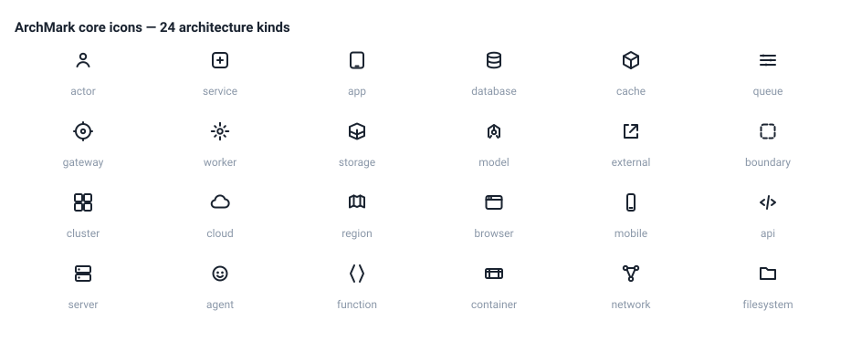

# ArchMark — architecture-as-code for GitHub READMEs

[](https://github.com/parnish007/archmark/actions/workflows/ci.yml)
[](https://nodejs.org/)
[](./LICENSE)

> Not affiliated with Archmark® (archmark.co) nor sparkymat/ArchMark bookmark manager.

Describe your system as concise text — get deterministic diagrams plus semantic flow
animations, rendered natively by GitHub. No cloud account. Local, offline, deterministic.

## Watch it run

This animation is not a recording. It is a production ArchMark asset
(`examples/hero/archmark.hero.request.*.svg`), generated by `archmark build`,
freshness-checked in CI, and rendered live by your browser:

<picture>
  <source media="(prefers-color-scheme: dark)" srcset="./examples/hero/archmark.hero.request.dark.svg" />
  
</picture>

## Write this…

```archmark
actor user "User"
browser frontend "Frontend"
api api "API"
model model "AI Model"
database db "PostgreSQL"

user -> frontend
frontend -> api
api -> model
api -> db

flow request {
  user -> frontend
  frontend -> api
  api -> model
  api -> db { type: write }
}
```

## …get this

The same source produces deterministic light/dark diagrams — text → architecture →
behavior in one build:

<!-- archmark id=system
actor user "User"
service frontend "Frontend"
service api "API"
database db "PostgreSQL"

user -> frontend
frontend -> api
api -> db
-->

<!-- archmark-render:start system -->
<picture>
  <source media="(prefers-color-scheme: dark)" srcset="./archmark.dark.svg" />
  
</picture>
<!-- archmark-render:end system -->

## Capabilities

- **Architecture DSL** — components, connections, groups, typed flows, coded diagnostics
- **Deterministic static SVG** — light/dark pairs via `<picture>`-ready assets
- **Semantic animation** — request/response/read/write/event/failure/recovery compiled
  (Flow → Timeline → Animation IR) to a verified SMIL subset: no JavaScript, finite, freezes
- **README-native** — `init` / `build` / `check`; `check` is a CI freshness gate
- **Bespoke iconography** — 24 architecture kinds, each with its own Technical Round icon

## Icons

<picture>
  <source media="(prefers-color-scheme: dark)" srcset="./docs/assets/icon-gallery.dark.svg" />
  
</picture>

See all supported architecture kinds → [docs/visual-system.md](./docs/visual-system.md)

## Verified, honestly

Production-generated SMIL flow assets have been verified through GitHub rendering in
Chromium, Firefox, and Playwright WebKit; browser compatibility checks are also available
as a separate non-blocking workflow. Full evidence ledger (and explicit non-claims) →
[docs/verification.md](./docs/verification.md)

## Install (from source — npm release pending)

```bash
git clone https://github.com/parnish007/archmark.git
cd archmark
pnpm install --frozen-lockfile
pnpm build
node ./dist/cli/cli.js init
node ./dist/cli/cli.js build
node ./dist/cli/cli.js check
```

(`npx archmark` will work after the first npm release; until then build from source.)

v0 is CLI-only: no programmatic library API is exposed or supported (`exports` is
empty by design; deep imports into `dist/` are not a public contract).

## Docs

- [docs/syntax.md](./docs/syntax.md) — the DSL
- [docs/visual-system.md](./docs/visual-system.md) — icons, themes, line rules
- [docs/animation.md](./docs/animation.md) — semantic animation model
- [docs/architecture.md](./docs/architecture.md) — compiler and renderer internals
- [docs/verification.md](./docs/verification.md) — evidence ledger
- [SPEC.md](./SPEC.md), [ARCHITECTURE.md](./ARCHITECTURE.md), [docs/adr/](./docs/adr/)

## Limitations

- One group level; groups are single-membership.
- Safari on Apple hardware and macOS runtime are unverified (CI is Ubuntu + Windows).
- Existing same-name files are replaced only if recognized as ArchMark-generated;
  files from pre-marker versions: delete once and rebuild (output is deterministic).
- Icons target 20px and above; 16px is best-effort.

Status: v0 production core (static SVG + semantic SMIL animation + CLI build/check).

License: Apache-2.0. See THIRD_PARTY_NOTICES.md, CONTRIBUTING.md, SECURITY.md.
