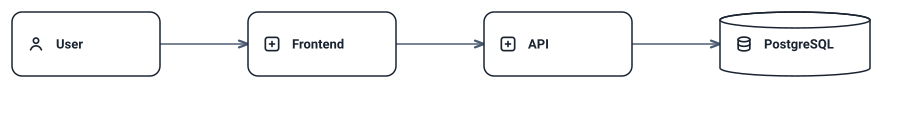

# ArchMark — beautiful, animated architecture-as-code for GitHub READMEs

> Not affiliated with Archmark® (archmark.co) nor sparkymat/ArchMark bookmark manager.

ArchMark lets you describe architecture as concise text and generates publication-quality
diagrams (deterministic light/dark SVG) plus semantic flow animations (SMIL subset locally
verified animating in Chromium/Firefox/WebKit; CI browser runs pending — see docs/adr/ADR-004). No cloud account. Local, offline, deterministic.

```bash
git clone https://github.com/parnish007/archmark.git
cd archmark
pnpm install --frozen-lockfile
pnpm build
node ./dist/cli/cli.js init
node ./dist/cli/cli.js build
node ./dist/cli/cli.js check
```

(`npx archmark` will work after the first npm release; until then build from source.)

v0 is CLI-only: no programmatic library API is exposed or supported (`exports` is
empty by design; deep imports into `dist/` are not a public contract).

<!-- archmark id=system
actor user "User"
service frontend "Frontend"
service api "API"
database db "PostgreSQL"

user -> frontend
frontend -> api
api -> db
-->

<!-- archmark-render:start system -->
<picture>
  <source media="(prefers-color-scheme: dark)" srcset="./archmark.dark.svg" />
  
</picture>
<!-- archmark-render:end system -->


Status: v0 production core (static SVG + semantic SMIL animation + CLI build/check).
See SPEC.md, ARCHITECTURE.md, docs/syntax.md, docs/animation.md, docs/adr/.

License: Apache-2.0. See THIRD_PARTY_NOTICES.md, CONTRIBUTING.md, SECURITY.md.
