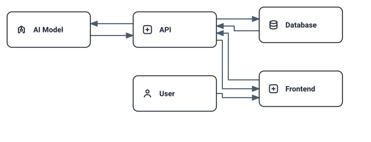

# ArchMark hero — write this…

```archmark
actor user "User"
browser frontend "Frontend"
api api "API"
model model "AI Model"
database db "PostgreSQL"

user -> frontend
frontend -> api
api -> model
api -> db

flow request {
  user -> frontend
  frontend -> api
  api -> model
  api -> db { type: write }
}
```

…get this (generated light/dark SVG):

<!-- archmark id=hero
actor user "User"
browser frontend "Frontend"
api api "API"
model model "AI Model"
database db "PostgreSQL"

user -> frontend
frontend -> api
api -> model
api -> db

flow request {
  user -> frontend
  frontend -> api
  api -> model
  api -> db { type: write }
}
-->

<!-- archmark-render:start hero.request -->
<picture>
  <source media="(prefers-color-scheme: dark)" srcset="./archmark.hero.request.dark.svg" />
  
</picture>
<!-- archmark-render:end hero.request -->


<!-- archmark-render:start hero -->
<picture>
  <source media="(prefers-color-scheme: dark)" srcset="./archmark.hero.dark.svg" />
  
</picture>
<!-- archmark-render:end hero -->


…and the `request` flow above is the animated behavior — same source, same build
(`archmark.hero.request.light/dark.svg`, M1 crisp-technical: solid request packets on the real
routed paths, receive pulses, write pulse on PostgreSQL, fade-out settle, once + freeze).
