# ArchMark hero — write this…

```archmark
actor user "User"
browser frontend "Frontend"
api api "API"
model model "AI Model"
database db "PostgreSQL"

user -> frontend
frontend -> api
api -> model
api -> db
```

…get this (generated light/dark SVG):

<!-- archmark id=hero
actor user "User"
browser frontend "Frontend"
api api "API"
model model "AI Model"
database db "PostgreSQL"

user -> frontend
frontend -> api
api -> model
api -> db
-->

<!-- archmark-render:start hero -->
<picture>
  <source media="(prefers-color-scheme: dark)" srcset="./archmark.hero.dark.svg" />
  
</picture>
<!-- archmark-render:end hero -->


…and this animated request flow (M1 crisp-technical):


