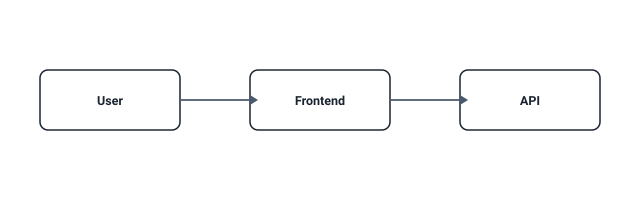

# ARCHMARK PHASE-0 RENDERING PROBE — NOT PRODUCT DOCUMENTATION

Branch `probe/github-rendering` only. Each probe isolates ONE mechanism for attribution.

## static external SVG

## picture light/dark
<picture><source media="(prefers-color-scheme: dark)" srcset="./p-gh-01-static.svg" /></picture>

## animate (opacity)

## animateTransform (scale)

## animateMotion (path attr)

## mpath

## stagger + parallel

## compound request flow

## pulse (M1 crisp)

## opacity / scale transitions

## freeze vs loop

## gradient

## clipPath (only if planned)

## a11y metadata (title/desc/role in all SVGs — inspect source)

## static fallback (first frame meaningful without animation — all probes)

## caching experiment
- same filename: `./cache-same.svg` (v1 now, overwrite v2 later, observe staleness)
- versioned: `./cache-v1.svg` (content-addressed candidate)

## canonical motion demo (M1)

